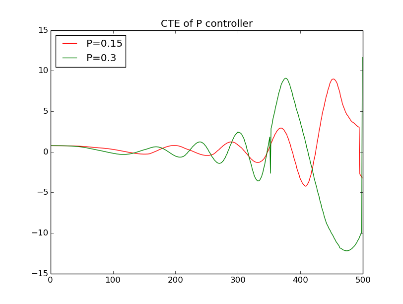
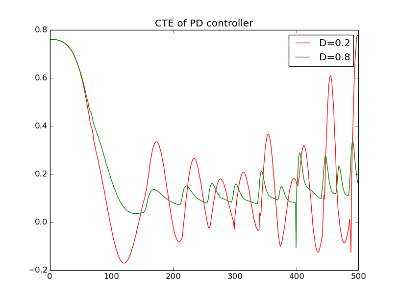
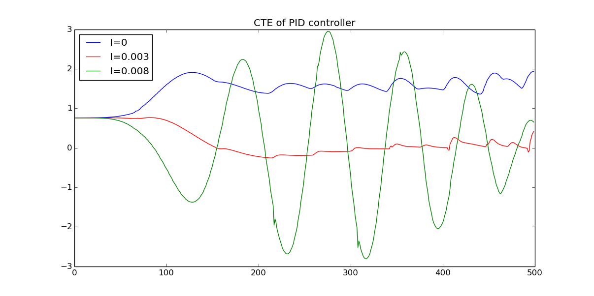
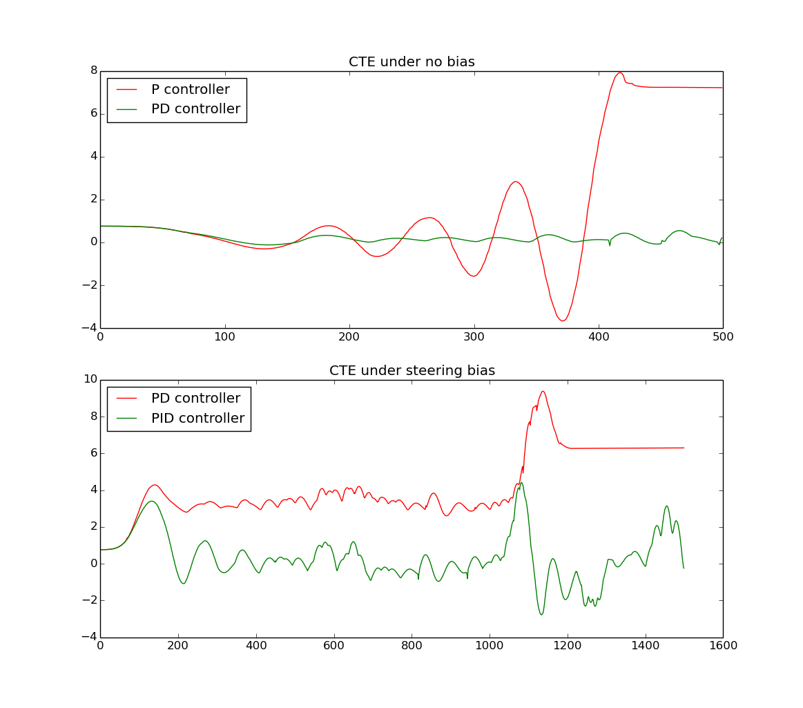

# CarND-Controls-PID
Self-Driving Car Engineer Nanodegree Program

---

## Algorithm description

For PID controller, it is composed of three control terms. The first term `P` stands for proportional. It generates control output proportional to error. It is the main corrective force to bring error down. However, it suffers from two major problems. It will cause overshoot because it has no notion of error change rate. Second, it cannot correct system bias.
```
U = -Kp * error
```
The second term, `I` stands for integral. It generates control output proportional to the integral of error over time. It is mainly responsible for correcting system bias because system bias will accumulate and dominate the integral error.
```
U = -Ki * sigma(error)
```
The third term, `D` stands for derivative. It generates control output proportional to the time derivative of error. It is mainly responsible for dampening the oscillation of P control as it look at the rate of change in error and apply opposite control to reduce overshoot.
```
U = -Kd * error_dot
```

I mostly followed the PID examples taught in class, with some minor modifications to pass the test. In short, the PID controller takes current CTE as input, computes three error terms: `p_error` for position error, `d_error` for derivative error and `i_error` for integral error. Each error is scaled by its respective gain `Kp`, `Kd` and `Ki` and summed. Then the control output will be the negative of the sum of errors. Here I only control the steering.

In order to evaluate the effectiveness of PID controller, I also injected a constant **steering bias**. Without the bias, PD controller works fairly well, but in the prescence of system bias, we can see that PID controller is able to minimize CTE to close to zero while PD controller can only converge to a nonzero CTE.

## Implementation

In `PID.h` I added the following variables:
```cpp
double cte; // previous cte value
double cte_sum;
double dt;
```

In `PID.cpp`, I set the cte initial value to a large negative value. This way, I can detect if it is the very first cte update and I will not compute the derivative term as there is no previous cte to calculate from. The rest is straight-forward.

In `main.cpp`, after receiving the current CTE, I simply pass it to the PID controller and get the returned steering input. I took care to convert it to range `[-1, 1]` by the `atan` function. Bias injection is also added here.

In order to visualize cte over time, I added all cte into a vector and dump them into a file at the end. Then I wrote a `visualize.py` to compare the performance of these controllers.

## Parameters
The final parameters I used are:
```cpp
  double Kp = 0.35;
  double Ki = 0.003;
  double Kd = 0.35;
```
They are meaningful. `Ki` should be small because its error term is accumulated cte is quite large. `Kd/dt` should be larger than `Kp` because `delta_cte` is usually smaller than `cte` and thus the gain must compensate for the smaller error.

I arrived at these parameters by manual tuning. Initially having only `Kp` and then keep on adding `Kd` and finally `Ki`, while trying to maintain small cte over the entire course.

## Comparison of different gain parameters

### Kp

The larger the P values are, the faster and larger oscillation becomes.

### Kd

As D values become larger, the damping effect becomes more obvious. The fluctuations are less.

### Ki

If I value is too small, the controller is unable to correct steady-state bias.
If I value is too high, significant oscilation occurs.
With reasonable I value, error diminishes over time.

## Comparison of P, PD and PID controllers


As can be seen, P controller has big oscillation behavior. And this manifests as ego car waving inside the lane. On the contrary, PD controller quicly converges to CTE=0 and follows the reference path closely. The P controller oscilates significantly and eventually veered off track (t=420).

When a system bias is present (steering bias=0.5), PD controller cannot converge CTE to zero. This causes the ego car to drive very close to the edge of the road. When it comes to a sharp turn, it sometime is not able to steer back in time and went off course. That is what happened at t=1200. PID controller, nevertheless, can correct the system bias and stay on track the whole time.

With P_controller alone, there is significant waving.

If we set the Kd too high (in overdamped.mp4), there is significantly understeering in curves and the vehicle is constantly trying to correct, but not enough.

## Tricks

As per reviewer's suggestion, I reduce throttle according to CTE value. This helped stablize the car during sharp turns because large CTE will slow down the vehicle so that steer control can more easily correct CTE.

`double throttle = 0.3 - std::atan(std::fabs(cte))/M_PI/2;`

## Video recording

[](video/P_controller.mp4)

[](video/overdamped.mp4)

[](video/PD_with_steer_bias.mp4)

[](video/PID_with_steer_bias.mp4)

[](video/PID.mp4)
